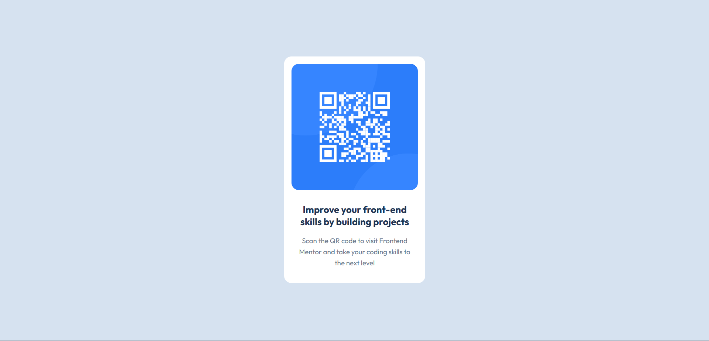

# Frontend Mentor - QR code component solution

## Table of contents

- [Overview](#overview)
  - [Screenshot](#screenshot)
  - [Links](#links)
  - [Built with](#built-with)
  - [Continued development](#continued-development)
  - [Useful resources](#useful-resources)
- [Author](#author)

## Overview

### Screenshot

### Links

- Solution URL: [Add solution URL here](https://your-solution-url.com)
- Live Site URL: [live solution](https://pazispeace.github.io/FrontendMentor_updated/)

## My process

### Built with

- Semantic HTML5 markup
- CSS custom properties
- BEM methodology
- Flexbox
- Mobile-first workflow

### Continued development

I need to focus on BEM methodology for naming css clasess

### Useful resources

- [codeguide](https://codeguide.co/) - This helped me with consistency with my css so it look clean

## Author

- Frontend Mentor - [@pazispeace](https://www.frontendmentor.io/profile/pazispeace)
